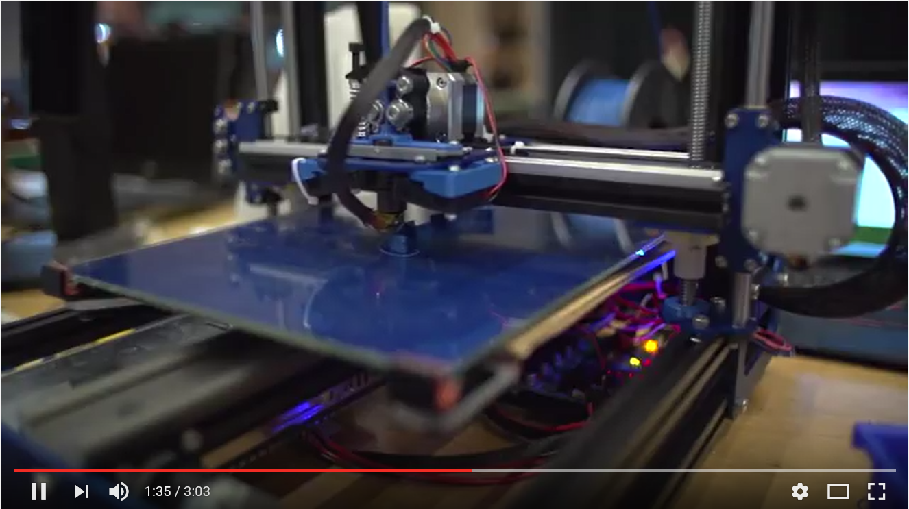

![IoT Labs][general-logo]
<!--
![IoT Labs][general-logo-guarda]
![IoT Labs][general-logo-porto]
![IoT Labs][general-logo-lisboa]-->

### Welcome!

Microsoft was at Web Summit and on our booth we had IoT Labs running every day, for which you could register in advance. They were a ***HUGE*** success - registrations sold out in less than 4 hours!
So we set out to deliver new labs in Portugal. Well, here they are!

> Goal: Allow you to try out Internet of Things (IoT) with **Microsoft** and **Raspberry Pi 3**! 

Watch this video to get inspired!

 

Take a look at this starting page, and then head to the [Labs](./content/readme.md). And remember: Share your progress with our official hashtags: **#ptiotlabs #MicrosoftPortugal**

### Table of contents
 * [Table of Contents](#table-of-contents)
 * [Agenda](#agenda)
 * [Requirements](#requirements)
 * [Teams](#teams)
 * [Azure Pass](#azure-pass)
 * [Labs](./content/readme.md)
 * [Azure and IoT](./content/azure-and-iot.md) **(Recommended Reading)**
 * [Portuguese Community](#portuguese-community)
 * [Conclusion & Next Steps](#conclusions-next-steps)

The **IoT Labs** use Windows 10 IoT, typically running on a Raspberry Pi 2 or 3, although other boards are also capable of running Windows 10 IoT. If you will be going through any of these labs you need to first prepare your **development environment**.

### [Agenda](#agenda)

Here is the planned agenda!

| | |
|---|---|
| 9:00 | Welcome & Registration |
| 9:30 | Microsoft IoT in 30 mins… |
| 10:00 | Lab Hacking (Starts) |
| 12:00 | Microsoft Cloud in 30 mins… |
| 12:30 | Lunch |
| 13:30 | Lab Hacking (Cont.) |
| 17:30 | Lab Ends |
| 17:40 | Welcome & Registration |

After a quick introduction on the Internet of Things, the IoT Labs will focus on the two key areas in IoT where Microsoft plays a role: IoT services in Azure and devices. We’ll cover IoT devices and get an overview of the popular development boards like Arduino, Netduino, Raspberry Pi … Besides using the traditional operating systems and development languages (Linux, C, Python …) for these boards, we’ll also explore the benefits that Windows 10 IoT can bring. 
Before Lunch, we'll also cover the cloud services side. We’ll explore the typical IoT architecture and use Azure services such as Event Hubs/IoT Hub and Stream Analytics.  

The hack begins! You'll have several labs to choose. We recommend you to go through the Labs. This are completely documented lab you can follow to get started. 

Afterwards, why not implement you own idea? Creativity is encouraged!

### [Requirements](#requirements)

As a requirement, we ask you to bring you laptop! If you have a macOS, you won't be able to run the Windows 10 IoT Labs, but all the remainder it will run OK. Or you can just run a virtualized Windows on top of your mac!

For all the requirements, here is a list:
* Windows 10 (build 10240) or better 
* Visual Studio 2015 – Community edition is sufficient, Enterprise and Professional works. 

> Note: While you setup Visual Studio, ensure you do Custom install and select the checkbox ‘Universal Windows App Development Tools –> Tools for Windows SDK’. 

In case you have previously setup **Visual Studio 2015/2017** and **Universal Windows Apps templates** are missing, you would either need to start the Visual Studio Setup again –> Repair, then select the Universal Windows App Dev. Tools. Or try installing the missing SDK here. 
Windows IoT Core Project Templates. You can download them from [here](https://visualstudiogallery.msdn.microsoft.com/55b357e1-a533-43ad-82a5-a88ac4b01dec). Alternatively, the templates can be found by searching for Windows IoT Core Project Templates in the [Visual Studio Gallery](https://visualstudiogallery.msdn.microsoft.com/) or directly from Visual Studio in the Extension and Updates dialog (Tools > Extensions and Updates > Online). 
Make sure you’ve enabled developer mode in Windows 10 by following [these instructions](https://msdn.microsoft.com/library/windows/apps/xaml/dn706236.aspx).
 
That’s it! 

### [Teams](#teams)

We have a **total of 15 IoT Kits** and plenty of sensors. We ask everyone to **make teams of a maximum of three**, so you can enjoy the Labs and everyone participate.

### [Azure Pass](#azure-pass)

The Azure Pass allow you to access and use Microsoft Azure withou any feature limitation. You can redeem promo codes via the redemption site, [www.microsoftazurepass.com](www.microsoftazurepass.com), which entitles you to activate the your Azure account. 
Passes are limited to *1-month*, *$100*, whichever comes first. Unlike the Azure Access program. Azure passes do not require customer credit card information. Azure passes are typically used for customer PoC’s, field and partner training events, marketing campaigns, and other events.  

[Reedeem you Microsoft Azure Pass here](http://www.microsoftazurepass.com/)

### [Labs](#labs)

| Duration | Lab | Description |
|---|---|---|
| 40 min | [Labx.x - Raspberry Pi and the Fez Hat](/content/Lab-x.x-Raspberry-Pi-and-the-Fez-Hat.md) | Desc Desc Desc |

### [Portuguese Community](#portuguese-community)

The maker community is growing everyday! From startups, freelancers to hobbbyists all Makers intend to discuss new ideas, hot to prototype, share projects, select partners and suppliers, plan projects and event get funding. Here we leave you a way to participate in this community:

 * [Facebook IoT Portugal Group](https://www.facebook.com/groups/IoTPortugal) - Facebook group for IoT related topics in Portugal.
 * [IoT Summit](http://www.iotsummit.pt/) - Portuguese community event for startups, freelancers and hobbyists. 
 * [Arduino Portugal](http://www.arduinoportugal.pt/) - Portuguese Makers community around Arduino. 

---

### [Conclusion & Next Steps](#conclusions-next-steps)
In this IoT Labs, you learned about general IoT practices with Windows 10 IoT, Linux and several development languages like C# and javascript.

As you already understood, IoT can be fun and always takes you into prototyping. There are several projects shared by the community that can help implement you project. We'd like to leave a set of resource you may find usefull.
 * [Hackster.io](https://www.hackster.io/) - Hackster is a community dedicated to learning hardware.
 * [Maker Faire](http://makerfaire.com/) - Maker Faire is the Greatest Show (and Tell) on Earth—a family-friendly festival of invention, creativity and resourcefulness, and a celebration of the Maker movement.
 * [Make:](http://makezine.com/projects/) - Maker Media is a global platform for connecting Makers.
 * [ConnectTheDots.io](http://connectthedots.io) - An open source project created by Microsoft to help you get tiny devices connected to Microsoft Azure IoT and to implement great IoT solutions taking advantage of Microsoft Azure advanced analytic services such as Azure Stream Analytics and Azure Machine Learning
 * [fritzing](http://fritzing.org/) - Fritzing is an open-source hardware initiative that makes electronics accessible as a creative material for anyone.
 * [Instructables](http://www.instructables.com/howto/iot/) - The seeds of Instructables germinated at the MIT Media Lab as the future founders of Squid Labs built places to share their projects, connect with others, and make an impact on the world.
 * [DIYhacking](https://diyhacking.com/about-diy-hacking/) - DIY Hacking (Do It Yourself!) is a non-profit Indian organisation working to promote the Maker culture. 

And remember, when running your personal project, please ***share*** with Microsoft Portugal. We'll provide you guidance and help you and your projecto to get to the next level!

***Enjoy the Labs!***

[general-logo]: ./images/banner-geral.png "IoT Labs"
[general-logo-guarda]: ./images/banner-guarda.png "IoT Labs"
[general-logo-lisboa]: ./images/banner-lisboa.png "IoT Labs"
[general-logo-porto]: ./images/banner-porto.png "IoT Labs"
